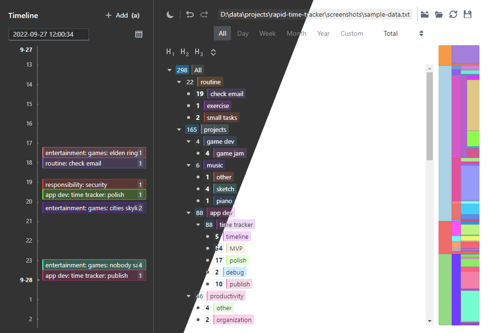
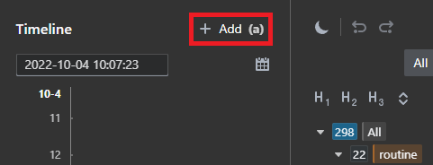
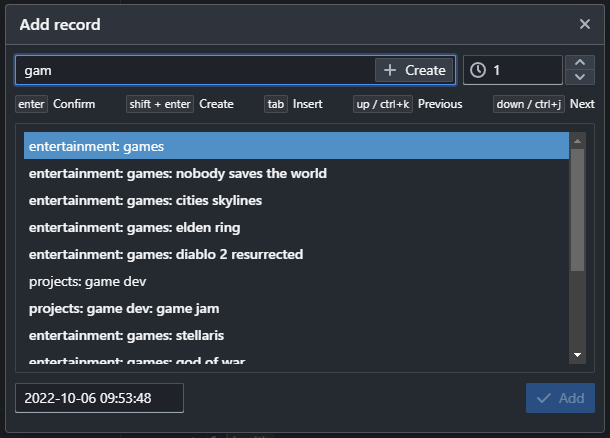
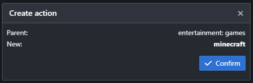
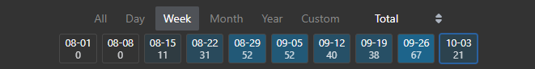
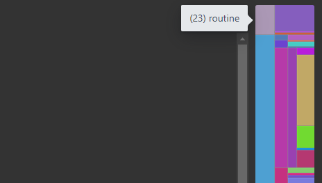

# Rapid Time Tracker

Rapid Time Tracker is an ultra-lightweight time tracker operating on a local text file. [Download here](https://github.com/TommyX12/rapid-time-tracker/releases).
- **Fast**: Intelligent fuzzy search enables rapid entry input.
- **Logical**: Recorded activities are fully hierarchical, with visualizations capturing time-spending patterns at any scale.
- **Privacy first**: Data is stored in a local editor-friendly txt file, which can be managed in any way you'd prefer.

---



---

## Table of Contents
- [Getting Started](#getting-started)
  - [Download binary](#download-binary)
  - [Building the binary yourself](#building-the-binary-yourself)
  - [Development build](#development-build)
- [Basic Usage](#basic-usage)
- [Advanced Usage](#advanced-usage)

---

## Getting Started

Rapid Time Tracker is built with [Electron React Boilerplate](https://github.com/electron-react-boilerplate/electron-react-boilerplate). Windows, macOS, and Linux are all supported.

### Download binary
Grab the latest binary from the [releases page](https://github.com/TommyX12/rapid-time-tracker/releases).

### Building the binary yourself

If you want to build the library from source:

1. Clone the repository:
   ```bash
   git clone https://github.com/TommyX12/rapid-time-tracker.git
   ```
2. Enter the directory and install dependencies:
   ```bash
   cd rapid-time-tracker
   npm install
   ```
3. Build the binary:
   ```bash
   npm run package
   ```
   The built binary will be in `./release/build`.
  - **Mac**: Go to `./release/build`, and open the `.dmg` file.
  - **Windows**: Go to `./release/build`, and open the `.exe` file.

### Development build

If you want to run a live-reload debug build for development:

```bash
npm start
```

## Basic Usage

To add your first record:
- Open Rapid Time Tracker
- Click `New` to create a new data file (.txt)
- Click `Add` on the top left
- Enter a new action name
- Press `shift + enter` to create the new action, press `enter` again to confirm
- Press `enter`, modify duration (e.g. your preferred unit), press `enter` again to add the record.

### Opening a data file

When using the time tracker for the first time, simply create a new data file or open an existing one from the welcome page. The data file will be a txt file that you can freely edit and move (see the [data file](#the-data-file) section).

### Recording time

In Rapid Time Tracker, an **action** means an activity whose time is being tracked. A **record** means a particular session of this activity.

A record consists of:
- The action (i.e. activity) that is being done
- The time when the action finished
- The duration of the action in this session (can be in any unit you want, most commonly *hours*)

Click the `Add` button to add a new record.



Use the record dialog to enter the information. See the [fuzzy finder](#the-fuzzy-finder) section for tips and advanced usage.



To create a new action for this record, type a name for the action into the input box. You can also type a hierarchical name (e.g. `entertainment: games: minecraft`), separated by `:`. Once you typed the name, **press `shift + enter`** to create a new action with this name, then `enter` again to confirm.



Once an action is selected/created, press enter (while the input box is active) to confirm. Change the duration of the record if needed, then press enter again to finally create the record.

#### Note on hierarchy

Records can only be created for **leaf** actions, which are actions with no children. If an action is no longer leaf, a new child called `other` will be automatically created and all existing records on the parent will be moved to it.

### Visualization

#### Timeline

The timeline (on the left side) allows you to view records in chronological order. Use mouse wheel scrolling to move across timeline. You can also click on the records to edit them.

#### Tree

The tree (on the right side) allows you to view the total recorded amount for each action, in a hierarchical structure. Records for child actions, e.g. `entertainment: games: minecraft`, automatically count towards records for ancestors (e.g. `entertainment` and `entertainment: games`).

You can click on the actions to edit them.


To view the total recorded amounts in a given period of time, use the date range toolbar on the top. You can also select the units (e.g. `Per day`, `Per week`, `Percentage`) to display instead of the total.



A block-visualization of the record times is shown on the right most side, with vertical height of the blocks corresponding to the total recorded duration for the action. You can hover on the blocks to see the exact amounts (depending on the unit option) for the particular action.



### Toolbar
The top level toolbar supports other miscellaneous features:
- Undo/redo
- Switch between light/dark mode

## Advanced Usage

### The fuzzy finder

#### Fuzzy searching

- If the query string does not contain `:`, the fuzzy search algorithm will match any entry that contains the query string as a sub-sequence. This means the entry `entertainment: games: minecraft` can be matched with the text `entmin`, for example.
- If the query string contains `:`, then **all text before the last `:`** will be matched exactly, and **all text after the last `:` will be matched with fuzzy search**. This means that `entertainment: gammin` will fuzzy search `gammin` among all entries that start with `entertainment:`.
- Matched entries are ranked intelligently, taking into account the "closeness" of the match as well as if the entry is recently used (i.e. has record inserted). One notable use of the smart ordering is that, when no query text is entered, the entries will be ordered by **last inserted records**. This means immediately pressing `enter` when adding new records will automatically select the most recently inserted action, which can be convenient.

#### Quick creation

- When performing quick creation (i.e. clicking the `Create` button or pressing `shift + enter`), the query text will be used to create an entry that has this exact text as its path.
- Pressing `tab` (or double-clicking) in the fuzzy finder will insert the currently highlighted entry into the query input box. This can be convenient to create actions under a certain parent. For example, to create `entertainment: games: skyrim`, you can enter `entgam` which is likely to highlight `entertainment: games`, then press `tab` to insert this into the text box. After this, you can type `skyrim`, then press `shift + enter` to finish creation.

### The data file

The data is stored in a readable and editable plain-text format. It will be automatically saved shortly after a modification is made in the app. You can also manually trigger a save by clicking on the save button.

If you edit the data file (e.g. with a text editor), you can make the app reload by clicking on the reload button.

An example data file may look like:
```
[ACTIONS]
2,routine,#F18928
  1,check email,#9366D7
  3,exercise,#C84BFB
  60,small tasks,#E96338
4,responsibility,#EB5151
  15,misc,#5BF7F5
    16,other,#E5F859
    35,check mailbox,#EDD483
12,entertainment,#83D072
  13,games,#541AFE
    56,elden ring,#F37894

[RECORDS]
2022-08-21 12:16:16,1,2
2022-08-21 13:17:31,3,1
2022-08-21 14:17:54,3,2
2022-08-21 15:18:23,1,4
2022-08-21 16:19:09,60,1
2022-08-21 17:19:34,35,1
```

The action section stores the action data, which are ID, name, and color respectively, separated by comma. The indentation represents the parent-children hierarchy (space is used for indentation).

The record section stores the list of records, with date, action ID, and duration respectively, separated by comma.
